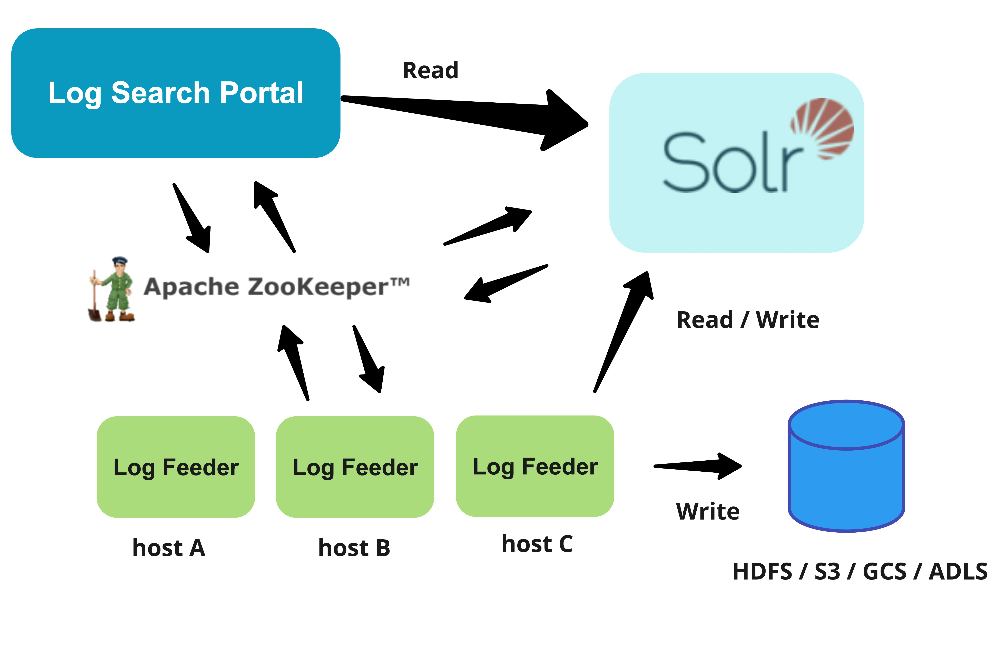

<!---
Licensed to the Apache Software Foundation (ASF) under one or more
contributor license agreements. See the NOTICE file distributed with
this work for additional information regarding copyright ownership.
The ASF licenses this file to You under the Apache License, Version 2.0
(the "License"); you may not use this file except in compliance with
the License. You may obtain a copy of the License at

http://www.apache.org/licenses/LICENSE-2.0

Unless required by applicable law or agreed to in writing, software
distributed under the License is distributed on an "AS IS" BASIS,
WITHOUT WARRANTIES OR CONDITIONS OF ANY KIND, either express or implied.
See the License for the specific language governing permissions and
limitations under the License.
-->
## Introduction

Log aggregation, analysis, and visualization for Ambari managed (or any other) services.

## Features

- Parse / aggregate and ship logs
- Send and index logs in Solr
- Store logs (structured or un-sructured format) in Cloud Storage (S3 / GCS / ADLS / WASB)
- Fultext Search in logs (if the logs are shipped to Solr)
- JWT/SSO support
- Support testing the log parsing on the UI

## Architecture

- Log Feeder: agent component on all hosts to monitor and shipping logs.
- Log Search Portal: REST API + UI for rendering logs
- Solr (Optional - default): storage for logs, used by both Log Search Portal and Log Feeder
- ZooKeeper (Optional - default): configuration service for Solr, Log Search and Log Feeder
- HDFS / S3 / GCS / ADLS: storage for logs (write only), used by Log Feeder [cloud mode](cloud_mode.md)

## Contents

- [1, Installation](installation.md)
- [2. Collections](collections.md)
- [3. Adding new logs to monitor](add_new_input.md) 
- [4. Development guide](development.md)
- [5. Using Log Feeder in Cloud mode](cloud_mode.md)
- [6. Contribution Guide and License](about.md)

